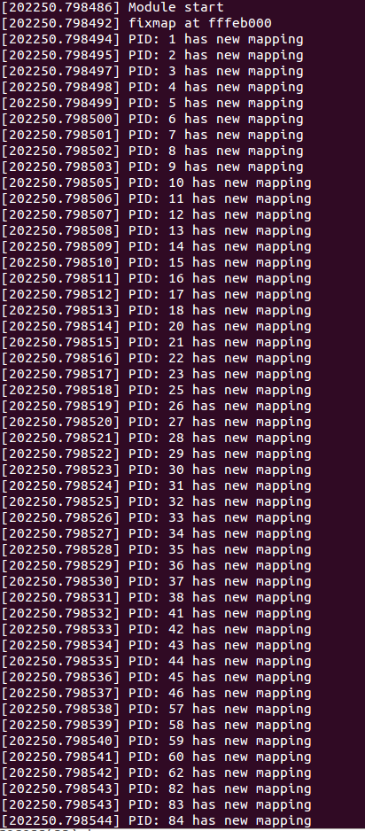

# Fixmap report
---

## Code
```C
#include <linux/kernel.h>
#include <linux/module.h>
#include <linux/mm.h>
#include <linux/mm_types.h>
#include <linux/sched.h>
#include <linux/export.h>
#include <linux/highmem.h>
#include <asm/fixmap.h>

// alloc_memory __set_fixmap __fix_to_virt

int fixmap(){
  unsigned long faddr;
  unsigned long paddr;
  struct page *page;

  page = alloc_page(__GFP_HIGHMEM);
  if (!page || !PageHighMem(page)) {
    printk("%s alloc_page() failed.\n", __func__);
    return -ENOMEM;
  }

  paddr = page_to_phys(page);
  set_fixmap(20, paddr);

  faddr = __fix_to_virt(20);

  printk("fixmap at %lx\n", faddr);
  struct task_struct *pp;
  for_each_process(pp) {
    printk("PID: %d", pp->pid);
    if(__fix_to_virt(20) == faddr){
      printk("true\n");
    }
  }

}

static int __init fmap_init (void) {

  int x = 0;
  printk("Module start\n");

  x = fixmap();

  return 0;

}

static void __exit fmap_exit (void) {
  
  printk("Module end\n");

}

module_init(fmap_init);
module_exit(fmap_exit);
```

## Result
